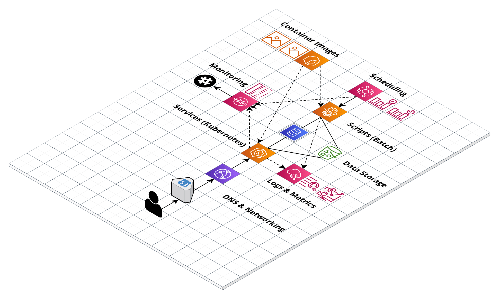
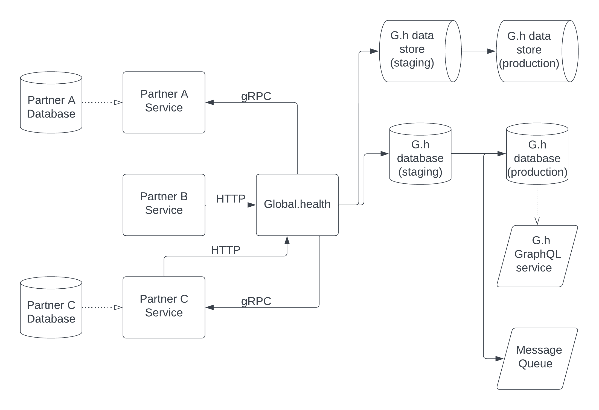
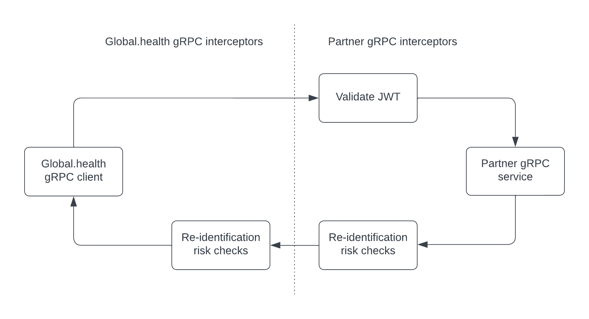
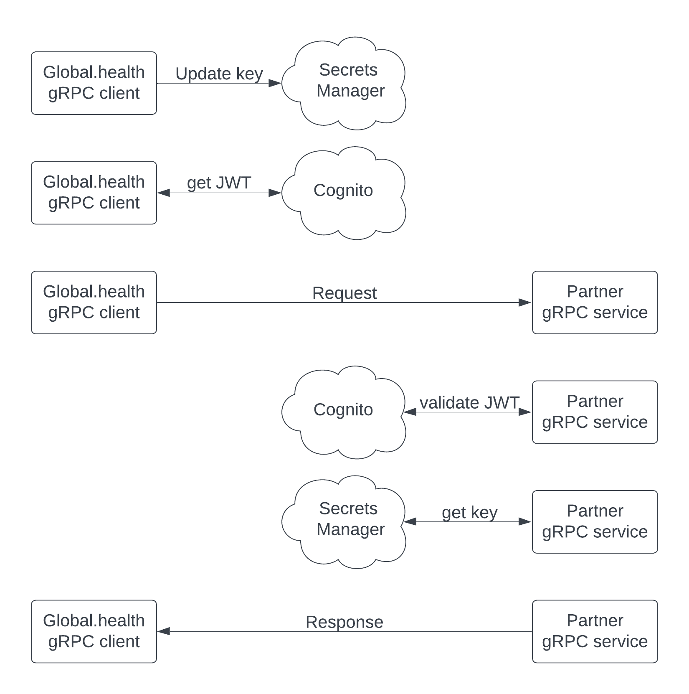

# Global.health federated system

This is a work in progress showing a distributed system sharing data and analytic work while preserving anonymity. This repository contains code showing how such a system, separated by components into individual Docker containers, can work. Three roles exist in the system: data producers, consumers, and a broker. Partners with Global.health comprise the data producers and consumers; a partner can serve both roles. Global.health exists as the sole data broker, and its services in the federated system works with its other services and systems, so that it can manually review data as needed and share data via web portal and/or interactive visualizations as desired.

Below is a diagram of the Global.health cloud infrastructure. Services run in a Kubernetes cluster using the Fargate compute environment. Logging and monitoring uses additional cloud services and Slack.



Below is a diagram of the federated system architecture and the data life-cycle. Partner services and databases exist on partner hardware and networks. Partners consuming data request work from Global.health via HTTP, and Global.health transforms these HTTP requests into gRPC requests for relevant partners sharing data. Partners perform work or retrieve case data, then send the results back to Global.health. The data may enter a staging environment, if it requires manual approval. Approved data enters a production environment, where the public may access it via GraphQL API, and Global.health also publishes a message to an AMQP topic queue, which subscribers (including the general public) may use to automate retrieval of new data.



Below is a diagram of gRPC interceptors. Global.health sends a JSON Web Token (JWT) to a partner, which validates it before processing the request. When partners send responses, they may perform any desired checks for anonymity and adherence to laws and ethics, then they encrypt the response. Global.health decrypts the response, performs its own ethical and legal checks, and then accepts the response and processes the data payload.



Below is a diagram of the request-response lifecycle. Before each request, Global.health updates the encryption key, and requests a JWT. Before each response, a partner validates the JWT, and retrieves the encryption key for use.



TEXT ABOUT TLS + NETWORKING HERE

This system supports both x86 and arm64 machines. Users need Docker, docker-compose, and populated `.env` files. If running demo scripts, users will also need Python.

## Local run

Users can run all system components on their computers via the compose stack, wrapped by a shell script:
```
./run_e2e.sh
```

Local runs also create a simulator for outbreaks, which receive HTTP requests to create cases in partner databases.

The `demo` folder includes a set of scripts for showing system features in real-time.

Users can also run individual components by navigating to the relevant directory and running the relevant `run_<COMPONENT>.sh` shell script.

## Testing

Users can run all the suite of full system tests on their computers via the compose stack, wrapped by a shell script:
```
./test_e2e.sh
```

Users can also run the suite of tests for individual components by navigating to the relevant directory and running the relevant `test_<COMPONENT>.sh` shell script.

## Protocol buffers

gRPC uses .protobuf files to define contracts for data payloads and create boilerplate code in `_pb2.py` and `_pb2_grpc.py` files used by clients and services. These files exist in the `protobufs` directory. Users may need to regenerate this code from time to time. Running `generate_gh_grpc.sh` and `generate_partner_grpc.sh` will create or update code used by Global.health and partner systems, respectively.
